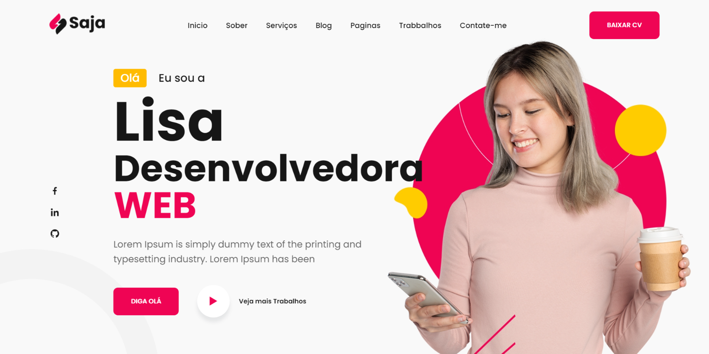

# portfolio_html_css_js_v2
Protifólio base HTML CSS JS responsivo

Projeto que utiliza tecnologias HTML, CSS e JavaScript puros. 
-Foram utilizadas bibliotecas de icones, animações e fontes externas. 
-> Scrollreveal para animaçoes com JS
-> Google Fonts com a fonte Popins
-> Boxicon para icones

## Demo

## Referências
 
- Scrollreveal: https://scrollrevealjs.org/
- GoogleFonts: https://fonts.google.com/
- Boxicon: https://boxicons.com/
